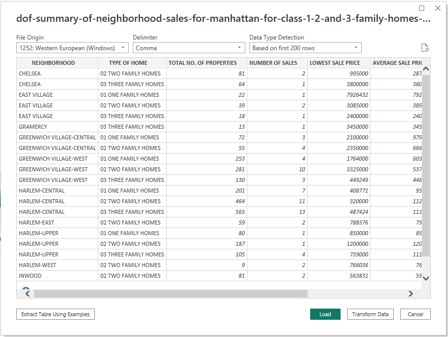

# Manhattan Neighborhood Sales for 1-3 Family Homes in 2009

## Resources
Data source: dof-summary-of-neighborhood-sales-for-manhattan-for-class-1-2-and-3-family-homes-2009-1.csv

Software: Microsoft Power BI Desktop 2.116.622.0

## Project Objective
### Use the provided csv file to create a dashboard to tell the best possible data driven story.

## Processing and Visualization
After inspecting the raw csv file, I connected it to Power BI as a text file. 

Upon careful inspection, I determined that the majority of the data was imported without any issues. However, I did need to perform some data manipulation, including the proper categorization of several columns and the implementation of comma separators to enhance readability.

### Please watch the video below demonstrating how to navigate the dashboard

<iframe width="980" height="500" src="https://www.youtube.com/embed/pBy1zgt0XPc" title="YouTube video player" frameborder="0" allow="accelerometer; autoplay; clipboard-write; encrypted-media; gyroscope; picture-in-picture; web-share" allowfullscreen></iframe>

<a href="https://app.powerbi.com/view?r=eyJrIjoiNmExMmY0NTYtOWVjZS00MDgzLTgyMDEtNWU0YWMxMjVkOTVlIiwidCI6ImRiMTUyMWRlLTEwYTYtNGIzNC05MDJiLTc4NGNiMmEyNjM5OCIsImMiOjZ9" target="_blank">View the Dashboard on the web</a>

## Drawing Insights

1. The dataset comprises a total of 4,722 properties, and Harlem-Central ranks first with 1,228 properties, while Midtown East ranks tenth with 125 properties. One possible reason for the big variance could be the difference in the size and population of the two neighborhoods. Harlem-Central is a larger neighborhood with a higher population density than Midtown East, which may result in a greater demand for housing and more properties available for sale.
2. The dataset encompasses a total of 135 sales. Harlem-Central secures the first position with 31 properties sold, while Washington Heights Lower secures the tenth position with four properties sold. It is possible that the difference is due to the disparity in the number of properties listed for sale in each neighborhood. There may simply be more opportunities for buyers in Harlem-Central. Additionally, factors such as demand, location, and property size also play a role.
3. The largest segment of the properties in the dataset is comprised of 2-Family Homes, accounting for 39.8% of the dataset. 1-Family Homes are the second most common property type, constituting 37.6% of the dataset, while 3-Family Homes represent the smallest share, accounting for 22.5% of the dataset. One factor that might be affecting this is the historic patterns of development in Manhattan, which often involved the conversion of single-family homes into multi-family dwellings to accommodate the growing population. 2-family homes can provide a good balance between affordability and space for families, making them a popular choice in densely populated urban areas like Manhattan.
4. Lastly, the slicer located in the upper-right corner of the report provides users with the ability to select a neighborhood of interest. Upon selection, the table below will dynamically update to display pertinent information relating to the sales that occurred in the chosen neighborhood.

---
Return to the [Homepage](https://kenlo94.github.io/)
